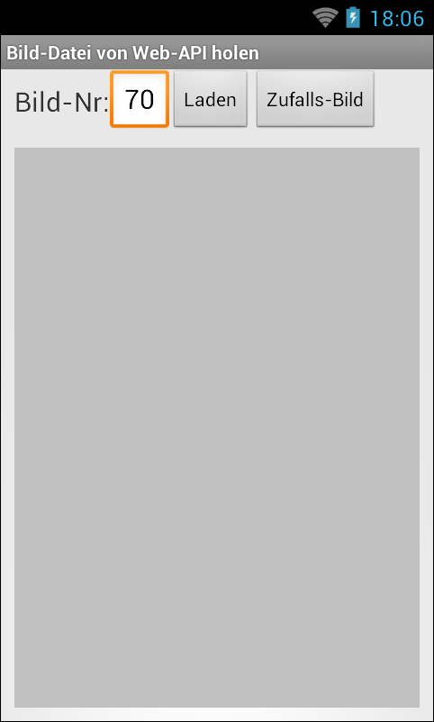

# Android-App "Bild von Web-API" #

 

Simple Android app that fetches a random picture showing a person from [randomuser.me](https://randomuser.me/).

The author of this app is not related to the developer/provider of [randomuser.me](https://randomuser.me/).

 

Identifiers (names for classes, variables and methods), UI text and (JavaDoc) comments are in German only.

 

----

## Screenshots ##

 

  

 

The screenshots were taken from the emulator.

 

----

## License ##

See the [LICENSE file](LICENSE.md) for license rights and limitations (BSD 3-Clause License).
